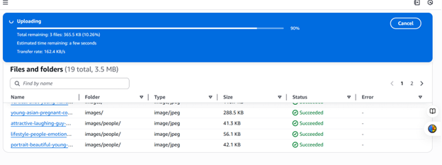

---
---

## 🌐 How I Hosted a Static Website on AWS S3 (Unsecured)

In this Contents, I'm going to walk you through how I hosted a simple static website on Amazon S3. This is great for testing or demo purposes where you don't need SSL (HTTPS). Follow along!


---

## 🪣 Step 1: Create an S3 Bucket

First, I logged into my AWS Management Console and went to the **S3** service. Here's what I did:

1. Clicked **Create bucket**.
2. Gave my bucket a unique name (e.g., `my-static-website-demo`).
3. **Disabled** "Block all public access" (important for public website).
4. Left other options as default.
5. Clicked **Create bucket** at the bottom..

> 💡 Tip: The bucket name must be globally unique and follow DNS-compliant naming (no uppercase letters, no spaces).


---

## 🧾 Step 2: Upload My Website Files

Next, I uploaded my HTML, CSS, and other static files to the bucket. folder and file should be done separately.

1. Opened the newly created bucket.
2. Clicked **Upload** → **Add files**.
3. Selected my `index.html` and any other files I needed.
4. Clicked **Upload**.

> 📝 Make sure your `index.html` is present — it acts as the homepage.





---

## 🌍 Step 3: Enable Static Website Hosting

To make the site viewable in a browser:

1. Went to the **Properties** tab of the bucket.
2. Scrolled to **Static website hosting**.
3. Clicked **Edit**.
4. Selected "**Enable**".
5. For **Index document**, entered `index.html`.
6. (Optional) If you have a custom error page, set it under **Error document**.
7. Clicked **Save changes**.
Do the same for *Block Public Access** . Remove the tick and save by typing 'confirm'. 

> 🧠 Note: This generates a public S3 website URL like:  
> `http://my-static-website-demo.s3-website-us-east-1.amazonaws.com`


---

## 🔓 Step 4: Edit Object Ownership and Enable Public Access with ACLs

Instead of writing a bucket policy, I used **Object Ownership settings** and **Access Control Lists (ACLs)** to make my website files publicly accessible. Here’s exactly what I did:

### 🧭 Step 4.1 – Enable ACLs and Set Ownership

1. Went to the **Permissions** tab of my S3 bucket.
2. Scrolled down to the **Object Ownership** section.
3. Clicked the **Edit** button.
4. Selected **ACLs enabled**.
5. Set **Bucket owner preferred** as the object ownership option.
6. Clicked **Save changes**.

> 📝 This allowed me to later make individual files public using ACLs, without needing a full bucket policy.


---

### 📂 Step 4.2 – Make Uploaded Files Public via ACL

After uploading my files (like `index.html`), I followed these steps:

1. Went to the **Objects** tab inside the bucket.
2. Selected the file(s) I wanted to make public (e.g., `index.html`, `style.css`, etc.).
3. Clicked **Actions** → **Make public using ACL**.
4. Confirmed the action when prompted.

> ✅ This made the files publicly accessible using the S3 static website URL.


website:


---


## 🚫 Disclaimer

This setup is for **non-secure** static websites (HTTP only). Don't use this method for production or sensitive data unless you add a CDN like CloudFront + SSL.

---

## 📁 Folder Structure in VS Code

Just for reference, here's how my project folder looked before uploading:

```
my-static-website/
├── index.html
├── style.css
└── images/
    └── logo.png
```

---

If you're following this and something goes wrong, double-check your bucket name and permissions. Hope this helps someone else too! 😊

```


```
